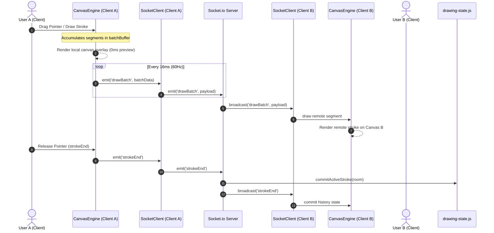

# CoDraw Collaborative Whiteboard Architecture

This document describes the high-level architecture, communication protocols, state management, and performance decisions of CoDraw.

---

## 🔄 1. Data Flow Diagram

The diagram below illustrates how local drawing events flow to the canvas and propagate to other connected peer clients.

---

## 📡 2. WebSocket Protocol Specifications

CoDraw communicates over Socket.io, utilizing a real-time event streaming payload structure.

| Event Name | Direction | Payload Structure | Description |
| :--- | :--- | :--- | :--- |
| `joinRoom` | Client ➔ Server | `{ room: String, username: String }` | Joins a collaborative session room. Triggers a history dump. |
| `roomHistory` | Server ➔ Client | `Array<Array<BatchPayload>>` | Server dumps room's complete historical strokes to the joining client. |
| `drawBatch` | Bidirectional | `{ shapeType: String, segments?: Array, x?: Number, y?: Number, ..., senderId: String }` | Relays coordinate batches for active paths or shape preview variables. Includes sender ID. |
| `strokeEnd` | Bidirectional | `{ senderId: String }` | Signals completion of a user stroke to save the current frame state to histories. |
| `undo` | Bidirectional | *None* | Reverts the client's last owned stroke from the history log globally for all clients. |
| `redo` | Bidirectional | *None* | Restores the client's last owned undone stroke from the redo log globally for all clients. |
| `updateShape` | Bidirectional | `{ strokeIndex: Number, newCoords: Object }` | Relays real-time shape translation vector coordinates for selected shapes. |
| `clear` | Bidirectional | *None* | Flushes canvas buffers and restarts room drawing state. |
| `cursorMove` | Bidirectional | `{ x: Number, y: Number }` / `{ id: String, username: String, x: Number, y: Number }` | Syncs and updates other clients' mouse/touch cursor trackers in real-time. |
| `changeUsername` | Bidirectional | `{ username: String }` | Updates participant's display name and broadcasts active list. |

---

## ↩️ 3. Global Selective Undo/Redo Strategy (Conflict Resolution)

Managing undo/redo operations in a collaborative canvas can be challenging. CoDraw implements an **Authoritative Selective Revert** system:

1. **Stroke Ownership**: Every coordinate batch and completed drawing stroke object is tagged with its owner's socket ID (`owner: socket.id`).
2. **Selective Deletion**: When a client clicks Undo, the server looks back through the room history log (`roomHistories`) and removes the last stroke *owned by that socket connection*, transferring it to `roomRedoHistories`.
3. **Layer Shifting**: Subsequent drawing layers drawn by other users are preserved in place.
4. **Vector Re-rendering**: After an undo or redo, the server broadcasts the updated chronological list of strokes to all clients using the `roomHistory` event. Each client clears their canvas context and redraws all active vectors sequentially, preventing race conditions or coordinate list corruption.

---

## ⚡ 4. Performance & Optimizations

To keep drawing smooth and lag-free, several optimizations were implemented:

1. **Coordinate Batching**: Instead of transmitting every cursor mouse event immediately (which congests network bandwidth), client segments are loaded into a `batchBuffer` and flushed at **60Hz (16ms interval)**.
2. **Cursor Throttle**: User cursor coordinate tracking (`cursorMove`) is throttled to a **30ms limit** using a high-resolution timer (`performance.now()`), avoiding thread blocking.
3. **Hardware Acceleration**: Peer cursors are rendered as absolute DOM divs overlaid on the canvas using CSS `transform: translate3d()` parameters, which bypass repaint pipelines and run on GPU composition.
4. **Nodemon Watch Exclusions**: Configured the dev server command to ignore `/server/data/` modifications, preventing server restarts and socket disconnections on disk-writes.
5. **High-DPI Scaling**: The canvas handles high-DPI (Retina) screens dynamically by backing dimensions to `devicePixelRatio` and scaling coordinates transparently, keeping lines sharp.

---

## 🛡️ 5. Conflict Resolution & Shape Transformations

* **Multi-User Layering**: Canvas operations are naturally collaborative since strokes are layered chronologically. In overlapping regions, whoever draws last paints over previous layers.
* **Non-Blocking Previews**: When drawing drag-preview shapes (like a rectangle or star), the client draws on a local preview buffer without broadcasting, only emitting the final shape details on release (`strokeEnd`), eliminating cursor-movement flicker on peers.
* **Separated Drawing Buffers**: Clients maintain separate stroke segment accumulator arrays (`activeStrokes`) mapped to individual socket IDs. This isolates concurrent freehand strokes from multiple users, avoiding layout interleaving or corrupted paths.
* **Selection Transform Tool**:
  - The client hit-tests pointer positions against the bounding boxes of shapes in the stroke log.
  - Selected shapes are highlighted locally with a dashed selection border outline.
  - Dragging translates the shape's coordinates and emits translation delta updates (`updateShape`) to peers in real time, shifting vectors cleanly across all screens.
