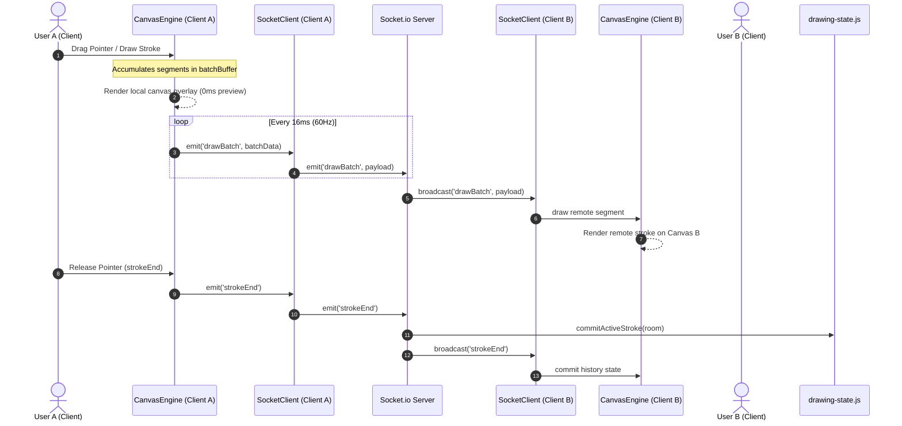

# CoDraw Collaborative Whiteboard Architecture

This document describes the high-level architecture, communication protocols, state management, and performance decisions of CoDraw.

---

## 🔄 1. Data Flow Diagram

The diagram below illustrates how local drawing events flow to the canvas and propagate to other connected peer clients.

---

## 📡 2. WebSocket Protocol Specifications

CoDraw communicates over Socket.io, utilizing a real-time event streaming payload structure.

| Event Name | Direction | Payload Structure | Description |
| :--- | :--- | :--- | :--- |
| `joinRoom` | Client ➔ Server | `{ room: String, username: String }` | Joins a collaborative session room. Triggers a history dump. |
| `roomHistory` | Server ➔ Client | `Array<Array<BatchPayload>>` | Server dumps room's complete historical strokes to the joining client. |
| `drawBatch` | Bidirectional | `{ shapeType: String, segments?: Array, x?: Number, y?: Number, ... }` | Relays coordinate batches for active paths or shape preview variables. |
| `strokeEnd` | Bidirectional | *None* | Signals completion of a user stroke to save the current frame state to histories. |
| `undo` | Bidirectional | *None* | Reverts the last stroke from the history stack globally for all clients. |
| `redo` | Bidirectional | *None* | Restores the last undone stroke from the redo stack globally for all clients. |
| `clear` | Bidirectional | *None* | Flushes canvas buffers and restarts room drawing state. |
| `cursorMove` | Bidirectional | `{ x: Number, y: Number }` / `{ id: String, username: String, x: Number, y: Number }` | Syncs and updates other clients' mouse/touch cursor trackers in real-time. |
| `changeUsername` | Bidirectional | `{ username: String }` | Updates participant's display name and broadcasts active list. |

---

## ↩️ 3. Global Undo/Redo Strategy

Managing undo/redo operations in a collaborative canvas can be challenging. CoDraw implements **Snapshot-based Sync with Server Authority**:

1. **State Snapshots**: Each client maintains a local history stack containing full canvas `ImageData` snapshots.
2. **Server History Log**: The server maintains a chronological array of stroke data (`roomHistories`) representing every action taken in the room, and a redo log (`roomRedoHistories`).
3. **Synchronized Revert**: 
   - When a client clicks Undo/Redo, it emits the event to the server.
   - The server alters the authoritative history array (`pop` or `push`) and broadcasts the action to all clients in the room.
   - Upon receiving the event, each client reverts their local history index and draws the resulting state, maintaining a perfectly consistent view.

---

## ⚡ 4. Performance & Optimizations

To keep drawing smooth and lag-free, several optimizations were implemented:

1. **Coordinate Batching**: Instead of transmitting every cursor mouse event immediately (which congests network bandwidth), client segments are loaded into a `batchBuffer` and flushed at **60Hz (16ms interval)**.
2. **Cursor Throttle**: User cursor coordinate tracking (`cursorMove`) is throttled to a **30ms limit** using a high-resolution timer (`performance.now()`), avoiding thread blocking.
3. **Hardware Acceleration**: Peer cursors are rendered as absolute DOM divs overlaid on the canvas using CSS `transform: translate3d()` parameters, which bypass repaint pipelines and run on GPU composition.
4. **Nodemon Watch Exclusions**: Configured the dev server command to ignore `/server/data/` modifications, preventing server restarts and socket disconnections on disk-writes.
5. **High-DPI Scaling**: The canvas handles high-DPI (Retina) screens dynamically by backing dimensions to `devicePixelRatio` and scaling coordinates transparently, keeping lines sharp.

---

## 🛡️ 5. Conflict Resolution

* **Multi-User Layering**: Canvas operations are naturally collaborative since strokes are layered chronologically. In overlapping regions, whoever draws last paints over previous layers.
* **Non-Blocking Previews**: When drawing drag-preview shapes (like a rectangle or star), the client draws on a local preview buffer without broadcasting, only emitting the final shape details on release (`strokeEnd`), eliminating cursor-movement flicker on peers.
